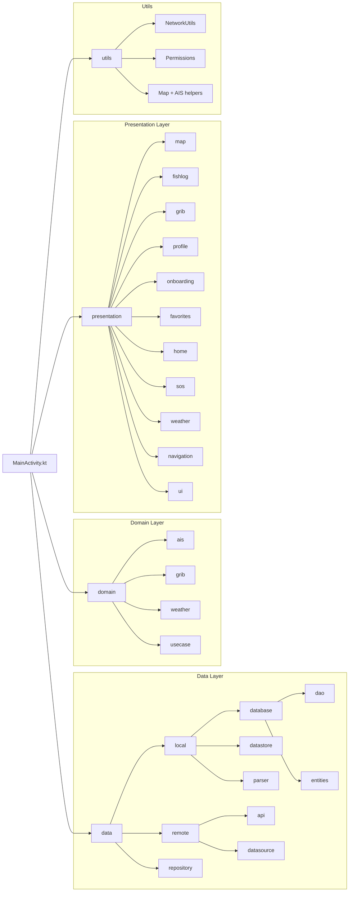

# Architecture Documentation

- [Introduction](#introduction)  
- [Languages and Tools](#languages-and-tools)  
- [System Requirements](#system-requirements)  
- [Project Structure](#project-structure)  
- [Architecture Patterns: MVVM and UDF](#architecture-patterns-mvvm-and-udf)  
  - [MVVM](#mvvm)  
  - [UDF](#udf)  
- [Layer Filtering and Weather Overlays](#layer-filtering-and-weather-overlays)  
- [Data Flow: GRIB Forecast Integration](#data-flow-grib-forecast-integration)  
- [Data Sources](#data-sources)  
- [Data Structures and Algorithms](#data-structures-and-algorithms)  
- [External Libraries](#external-libraries)  
- [Testing Strategy](#testing-strategy)  
- [Version Control Workflow](#version-control-workflow)  
- [Known Issues and Limitations](#known-issues-and-limitations)

---

## Introduction

This document is intended for developers who wish to understand, maintain, or extend the application.
This document outlines the architecture and development approach of our mobile application, designed to assist saltwater hobby fishers by visualizing maritime weather conditions, fishing logs, and safety measures . The app is built with Kotlin, Jetpack Compose, and MapLibre, and integrates weather and marine data from public APIs , metrologisk institutt and GRIB forecast files.

---

## Languages and Tools

- **Programming language**: Kotlin  
- **Build system**: Gradle  
- **IDE**: Android Studio LadyBug or newer 
- **Architecture patterns**: MVVM, Unidirectional Data Flow (UDF)  
- **Version control**: Git and GitHub  

---

## System Requirements

- **Minimum SDK**: 26  
- **Target SDK**: 34  
- **Minimum Android version**: 8.0 (Oreo)  
- **Required permissions**: Location access, Internet (The app works without permissions, but full functionality requires them)

### Rationale for SDK Version

We selected **minSdk 26** (Android 8.0) to maintain compatibility with the majority of devices in use today, while enabling access to key platform features such as scoped storage and better background location handling. **Target SDK 34** ensures the app adheres to the latest Android behavior changes and security updates.

---

## Project Structure

### Diagram Explanation

- **Data Layer**: Includes local Room database (DAO, entities), GRIB parsers, remote APIs (Retrofit), and repositories that abstract data fetching.
- **Domain Layer**: Pure models and logic for AIS, GRIB vectors, and use cases.
- **Presentation Layer**: Built with Jetpack Compose, this layer is organized by feature (e.g., map, fish log, favorites). Each submodule contains UI components, screens, and corresponding ViewModels following MVVM principles.
- **Utils**: Common utilities used across the app, including network status checks, location permission handling, and helpers for rendering map icons and weather interpretations.
This separation supports maintainability, testability, and a clear architectural flow aligned with MVVM and UDF.

---

## Architecture Patterns: MVVM and UDF

### MVVM

We use the Model-View-ViewModel pattern:

- **View**: Composable screens observe `StateFlow` and render UI reactively.
- **ViewModel**: Manages business logic and exposes UI state via `StateFlow`, and triggers data updates. 
- **Model**: Data classes represent domain objects such as wind vectors, current vectors, fishing logs, and user profiles.  
- **Repository**: Acts as a mediator between ViewModel and data sources (e.g., local Room database, GRIB parsers, REST APIs).

### UDF

Our app adheres to **Unidirectional Data Flow**, where:

1. UI sends user events to ViewModel  
2. ViewModel processes state and logic  
3. Updated state flows to UI via `StateFlow`  
4. UI recomposes accordingly

This ensures a predictable and testable flow of data.

## Object-Oriented Principles

The app maintains **low coupling** by isolating logic in ViewModels and using interfaces in repositories. For example, the `FishLogRepository` interface allows the ViewModel to remain unaware of database implementation details.

**High cohesion** is achieved by organizing code into feature-based packages ( `fishlog`, `map`, `profile`) where each module contains closely related responsibilities (UI + ViewModel + logic).

This modular structure makes features easier to develop, test, and maintain.

---

## Layer Filtering and Weather Overlays

The map screen uses a **layer filtering system**:

- Layers are grouped by category (e.g., Weather, Traffic, Alerts)
- Clicking a layer like "Wind Vectors" shows a **slider overlay** with:
  - Wind speed threshold selector
  - Timestamp selector for GRIB data
- Similar overlays exist for current, wave, and precipitation vectors

---

## Data Flow: GRIB Forecast Integration

1. **Fetch**: GRIB file is downloaded or cached locally  
2. **Parse**: `GribParser` extracts wind/current/wave/precipitation vectors  
3. **Store**: Parsed data goes into ViewModel (e.g., `GribViewModel`)  
4. **Filter**: UI filters data based on timestamp/thresholds  
5. **Render**: MapLibre layers display icons/heatmaps accordingly

---

## Data Sources

| Source            | Data Type      | API Used                             |
|------------------|----------------|--------------------------------------|
| Met Alerts        | Warnings       | https://in2000.api.met.no            |
| BarentsWatch      | AIS data       | https://ais.barentswatch.no          |
| Met Norway GRIB   | Weather (GRIB) | https://in2000.api.met.no/gribfiles |
| BarentsWatch FHI  | Fish Forbud    | https://www.barentswatch.no/bwapi    |

---

## Data Structures 

Key models include:

- `WindVector` – lon, lat, speed, direction, timestamp  
- `CurrentVector` – same as wind, parsed from ocean current GRIB  
- `WaveVector` – direction + significant wave height  
- `PrecipitationPoint` – delta precipitation (in mm) per timestamp

---

## External Libraries

- **MapLibre GL** – Map rendering  
- **Retrofit + Gson** – API access  
- **Room** – Local DB (fishing logs, favorites)  
- **DataStore** – Theme persistence  
- **OkHttp** – Auth/headers and debugging  
-  **Activity Result API** – Used to launch camera for catch log entries 
- **Coil** – Load profile/fishing photos  
- **Jetpack Compose** – UI  
- **Material 3** – Styling  

---

## Testing Strategy

We use a layered testing strategy with a mix of unit tests and manual testing:

### Unit Tests

- **ViewModels** (e.g. `FishingLogViewModel`, `PrecipitationViewModel`):
  - Tested with `MockK` and `StateFlow`
  - Assert correct repository interactions and state updates
- **GribParser**:
  - Tests for correct wind speed/direction, wave conversion, and precipitation delta
  - Handles missing variables and invalid input gracefully
- **Utility functions** (e.g. `haversine()`):
  - Verified with real-world coordinates and edge cases

### Manual + Integration Testing

- Tested on emulator and physical devices
- Scenarios include:
  - Overlay activation and sliders
  - Fishing log entries with photo
  - Offline support using cached GRIB files

### Mocking

- Android `Log` is mocked for JVM tests
- APIs with auth (e.g. BarentsWatch) are stubbed in tests

---
### Development Practices and Conventions

- All features are developed in dedicated branches (feature/xyz) and merged into main via Pull Requests, either through GitHub, IDE, or terminal.
- We aim to expose only immutable StateFlow from our ViewModels to enforce unidirectional data flow and maintain separation of concerns.
- Code is organized by feature ( map, fishlog, profile), rather than by layer (view, model), which improves navigation and maintainability. MVVM is followed consistently within each feature.
- Comments are added throughout the codebase, especially in more complex components such as GRIB parsing, ViewModel logic, and map overlays.

---

## Version Control Workflow

We use GitHub Flow:

- `main` is always deployable  
- Feature branches: `feature/`, `fix/`, `refactor/`  
- All changes go via Pull Requests  
- Commits follow conventional format when possible

---
## Extensibility and Maintainability

The app is structured for long-term maintainability and scalability:

- Feature-based folder structure simplifies navigation and onboarding
- ViewModels decouple UI and business logic, supporting testability
- GRIB parsing architecture is modular and extendable ( to support new weather types)
- Layer overlays and sliders are designed for reuse across vector types (wind, current, wave, rain)
- Repository pattern allows switching between local and remote data sources without major refactors
---

## Known Issues and Limitations (Warnings in the IDE)

### Bugs

- Bottom sheet may overlap content when keyboard is open  
- Wind arrows crowd the map at lower zoom levels  
- Heatmap rendering flickers during slider updates  

- **Deprecated methods in MapLibre**  
  Some methods used for polygon and layer styling are marked as deprecated in recent versions of MapLibre. These include APIs for adding polygon actions and related properties.  
   We opted to use them anyway because the newer alternatives are either experimental or lack sufficient documentation. The deprecated methods still function as expected.

- **Bottom Navigation Redundancy**  
  Tapping the bottom navigation item for a screen youre already on (especially **"Map"**) could cause unnecessary recompositions or failed navigation, in some cases the app can crash.
  we are aware of this but did not have the time to fix it.
  

- **Unused Variables and Parameters**  
  During development, we used a modular and flexible architecture (MVVM and composable UIs), which resulted in some parameters and variables being passed *"just in case"* — especially in shared components like `MapScreen`, `MapPickerScreen`, and view models.  
   Because of this, the compiler raises warnings about unused variables or parameters. These are mostly intentional to allow for future extensibility or reuse in other composables/screens. We prioritized functionality and stability over suppressing all warnings during the MVP phase.

- **Performance degradation with multiple layers active**  
  When all map layers (AIS, MetAlerts, GRIB data, favorites, etc.) are turned on at the same time, rendering performance may drop — especially on lower-end devices.

- **"Show more" alert functionality has degraded**  
  The feature that displays a snackbar alert when the user enters a hazard zone (MetAlerts polygon) , with a "Show more" button to reveal details, was implemented early in the project.  
   As the app logic and layer handling became more complex, this feature no longer behaves as originally intended. Specifically, the snackbar still appears, but the "Show more" action does not reliably open the alert details panel. We were unable to resolve this within the deadline.

 - **Android Studio Version Update During Development**  
  A new version of Android Studio was released during the development period. Although we did not need to make any changes to our project configuration, we switched to using the latest version in the final weeks. Everything continued to work as expected, and no breaking issues were observed.

- **UI on Very Small Screens**  
  The user interface is not fully optimized for very small screen sizes. While the app works on most devices, some components such as bottom sheets, sliders, or overlapping elements (e.g., weather overlays and layer controls) may appear cramped or clipped on smaller displays. This was not prioritized during development but could be improved in future iterations with more responsive layout handling.

### Missing Features

- No actual cloud sync for GRIB yet   
- Fishing log stats/filters are not implemented
- GRIB data area is currently hardcoded to the Norwegian west coast, but the system is designed to allow selectable regions in future versions.

---

### Security Concerns

- API keys (MapTiler, BarentsWatch) are hardcoded and exposed  
- No secure vault or build config injection used currently
