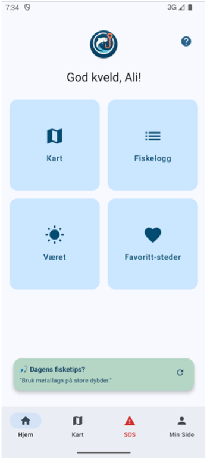
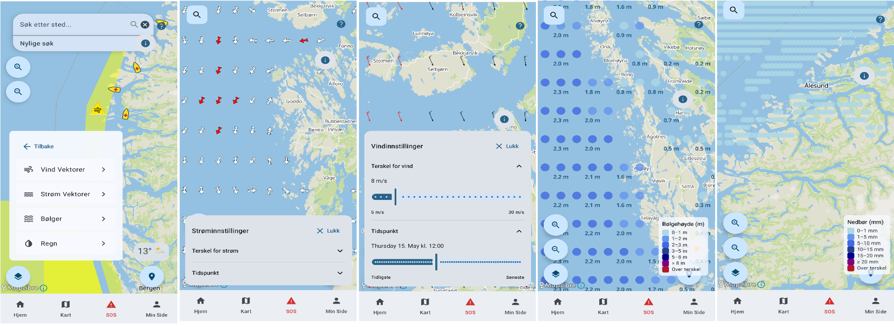
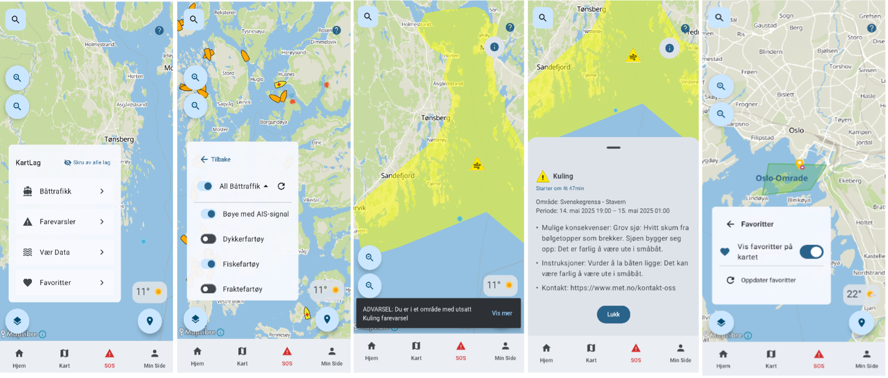

# Welcome to Group 46 in IN2000 – Spring 2025

## Group Members
- **Bendik Mendes Dahl** (bendikmd@uio.no)  
- **Johannes Støen** (johastoe@uio.no)  
- **Mohammad Ali Shakil** (mohas@uio.no)  
- **Kaja Mamelund Bradal** (kajambra@uio.no)  
- **Maria Helena Rogne** (marihrog@uio.no)  
- **Artin Akbari** (artina@uio.no)

## Table of Contents

1. [About the App – FiskeKlar](#fiskeklar)  
2. [How to Run the App](#how-to-run-the-app)  
   1. [Requirements](#requirements)  
   2. [Build and Run](#build-and-run)  
   3. [Features](#features)  
3. [Screenshots](#screenshots)  
4. [Known Issues and Limitations](#known-issues-and-limitations-warnings-in-the-ide)  
5. [Dependencies and Libraries](#dependencies-and-libraries)  
6. [Libraries Outside the Curriculum](#libraries-outside-the-curriculum)  
7. [Testing](#testing)  
8. [App Permissions](#app-permissions)  
9. [Further Documentation](#further-documentation)  
10. [References for Non-Native Drawables](#references-for-non-native-drawables)

---

## FiskeKlar

<p align="center">
  
</p>

**FiskeKlar** is an Android app developed in Kotlin with Jetpack Compose, designed for hobby fishers and ocean enthusiasts. It displays vessel data, weather alerts, wind and current conditions in real-time on an interactive map, and allows users to log their own catches.

---

## How to Run the App

### Requirements
- Minimum Android version: API 26 (Android 8.0 Oreo)
- Location permission (`ACCESS_FINE_LOCATION`)
- Camera access for profile and catch photos

### Build and Run
1. **Download or clone the repository** from GitHub:
   ```bash
   git clone https://github.uio.no/IN2000-V25/team-46.git

Alternatively, use the "Download ZIP" button on GitHub and extract the project.

2. **Open the project in Android Studio**  
- Choose "Open an existing project"
- Navigate to the extracted/cloned folder and open it

3. **Wait for Gradle sync to complete**  
- Android Studio will automatically download dependencies
  
4. **Connect a physical device** or start an **emulator**  
- The device/emulator must run **Android 8.0 (API 26)** or newer  
- Enable **location services** for full functionality  
- Ensure **internet access** is available for full functionality
5. **Build and run the app**  
- Click the run button or use **Shift + F10**  
- On first launch, **grant permissions** when prompted:
  - Location (optional but recommended)
  - Camera (for profile/catch photos)

### Features
- Displays AIS data from BarentsWatch with real-time vessel updates
- Fetches and visualizes wind,wave,rain and current data from GRIB files, with a time slider, and cutomisable treshold.
- Shows MetAlerts (weather alerts) on the map
- SOS Screen for emergency situations
- Lets users log catches with image and location, and create favorite fishing spots.
- Includes a profile screen with user info and statistics.

---

## Screenshots
---
### Home Screen


###  Catch Log (Fiskelogg)

|                       |                       |                       |
|-----------------------|-----------------------|-----------------------|
|  |  |  |
---
###  Weather Data Screen



---

###  Weather Alert Screen




###  SOS Screen
---


### Weather Screen


---
## Known Issues and Limitations (Warnings in the IDE)

See [ARCHITECTURE.md](./ARCHITECTURE.md#known-issues-and-limitations) for known limitations and warnings.

---

## Dependencies and Libraries

| Library                          | Purpose              | Description                                                                        |
| -------------------------------- | -------------------- | ---------------------------------------------------------------------------------- |
| **Jetpack Compose**              | UI                   | Declarative UI framework for building screens                                      |
| **Material 3**                   | Design Components    | Modern design elements for Compose                                                 |
| **Compose Icons Extended**       | UI Icons             | Extended set of Material icons for Compose                                         |
| **Google Fonts (Compose)**       | Typography           | Custom font support in Jetpack Compose                                             |
| **MapLibre GL**                  | Map Display          | Open-source map library for showing maps, vessels, and weather data                |
| **AndroidX Location**            | Location Handling    | Tracks user location and handles alerts                                            |
| **Play Services Location**       | Location Provider    | Provides fused location tracking on Android devices                                |
| **Room**                         | Local Database       | Stores catch logs and user data                                                    |
| **Datastore**                    | Preferences Storage  | Saves theme and UI settings persistently                                           |
| **Coil**                         | Image Handling       | Loads and displays images for catches and profiles                                 |
| **Media3 Common**                | Media Framework      | Enables audio/video playback (e.g., SOS sounds) *(optional)*                       |
| **Kotlinx.coroutines**           | Async Processing     | Fetches data without blocking the UI                                               |
| **kotlinx.coroutines.test**      | Coroutine Testing    | Supports testing of suspend functions and flows                                    |
| **Retrofit + Gson**              | API + JSON Parsing   | Communicates with BarentsWatch and MetAlerts APIs           |
| **OkHttp + Logging Interceptor** | Network Debugging    | Logs HTTP calls for troubleshooting                                                |
| **CDM / GRIB**                   | GRIB Parsing         | Reads meteorological GRIB files                            |
| **KSP**                          | Code Generation      | Used by Room to generate boilerplate automatically  |
| **ViewModel + LiveData**         | State Management     | Supports reactive and lifecycle-aware UI updates                                   |
| **JUnit, MockK**                 | Testing Framework    | Used to verify logic in ViewModels, data parsing and utilities                     |


---

## Libraries Outside the Curriculum

### MapLibre
Open source alternative to Google Maps. Used to display maps, vessels (AIS), wind, currents,rain, and alerts with full control over style and layers.
We combine MapLibre with MapTiler tiles and styles for custom map backgrounds and terrain rendering.

- [MapLibre Docs](https://maplibre.org/maplibre-native/android/api/)
- [MapTiler Docs](https://docs.maptiler.com)

### NetCDF-Java / CDM
Library by Unidata to read/write scientific datasets (GRIB1/GRIB2). Used to extract and parse wind,current,wave and rain data from GRIB files. Kotlins Java integration made integration seamless.

- [NetCDF Docs](https://docs.unidata.ucar.edu/netcdf-java/current/userguide/)  
- [CDM Docs](https://docs.unidata.ucar.edu/netcdf-java/current/userguide/common_data_model_overview.html)

### KSP (Kotlin Symbol Processing)
Used by Room and Hilt to generate binding and injection code at compile time, reducing boilerplate.

- [KSP Docs](https://kotlinlang.org/docs/ksp-overview.html)

### Stadia Maps
Used for location search and geocoding. We used their REST API to support searching and selecting geographic places from a search bar, which helps users navigate or set a fishing location.

- [Stadia Maps Docs](https://docs.stadiamaps.com)


### Datastore (Preferences)
Jetpack library for storing small amounts of data asynchronously, such as user settings or theme preferences. Used to persist theme mode across app restarts.

- [Datastore Docs](https://developer.android.com/topic/libraries/architecture/datastore)     

### Media3 Common
Part of Android’s new media playback framework. Used for playing alert sounds when the user is inside a alert area.

- [Media3 Docs](https://developer.android.com/reference/androidx/media3/common/package-summary)

### MockK
Kotlin-specific mocking library used for unit testing. Enables mocking of repository methods, Log.d, and other Android classes used for debugging and testing

- [MockK Docs](https://mockk.io)

### JUnit  (Jupiter)
Modern version of the JUnit testing framework offering parameterized tests, dynamic tests, and better lifecycle management. Used for testing.

- [JUnit Doc](https://junit.org/junit5/docs/current/user-guide/)

---
## Testing

We wrote unit tests for key components such as view models, GRIB parsing, and SOS calculations. Tests were written using JUnit, MockK, and kotlinx.coroutines.test.

- See [ARCHITECTURE.md](./ARCHITECTURE.md#testing) for details on test coverage. There is also comments on warnings in the project files themselves.


## App Permissions

| Permission                    | Purpose                                                                 |
|------------------------------|-------------------------------------------------------------------------|
| `ACCESS_FINE_LOCATION`       | To show the user’s location and trigger relevant weather alerts         |
| `CAMERA`                     | To take photos for profile and catch log                                |
| `READ/WRITE_EXTERNAL_STORAGE`| Required if images are saved to the file system                         |

## Further Documentation

For architectural details, file structure, design patterns and modeling diagrams:

- [ARCHITECTURE.md](./ARCHITECTURE.md): Detailed overview of the app's structure, MVVM implementation, and rationale behind chosen patterns and technologies.
- [MODELING.md](./MODELING.md): UML diagrams and system design illustrations supporting key use cases and flows.


## References for non native drawables


**Source of vessel icons**:  
The icons used for vessel types (e.g., Ambulance Boat, Fishing Vessel, Cargo Vessel) are based on the visual design of AIS vessel markers in the maritime map services provided by [BarentsWatch](https://www.barentswatch.no/).  


| Other drawables         | link |
|-------------------------|-----------|
|**Weather icons from NRKNO github** | [Weather icons](https://github.com/metno/weathericons/tree/89e3173756248b4696b9b10677b66c4ef435db53/weather/png ) |
|**Warningsymbol from NRKNO github** | [warning symbols](https://github.com/nrkno/yr-warning-icons/tree/6cc4920ead55e5cc6a40fd601d01d024a0abf7be/design/svg) |
|**YR Beaufort scale** | [Beaufort scale](https://hjelp.yr.no/hc/no/articles/360002022134-Vindpiler-og-Beaufortskalaen)|
|**Fish icon in fishinglog** |[Fish icon](https://www.flaticon.com/free-icon/fish_811643)|
|**Redningsskøyta logo in SOS screen** |[RS logo](https://rs.no/nullvisjon-mot-drukning/logo-nettside/)|
|**App logo ChatGPT** |[App logo](https://chatgpt.com/s/m_68264b7761b481919f3c7fcfe21f70de)|
| **Map Marker**                   | [Map Marker](https://www.margaretrivermountainbiketours.com.au/contact/map-marker-hi/map-marker.png) |
| **Favorite Location Pin**        | [Favorite Pin](https://cdn3.iconfinder.com/data/icons/map-location-5/48/1362643-map-marker-heart-512.png) |
| **Arrow Icon (Weather Screen)**  | [Arrow Up](https://icons.iconarchive.com/icons/custom-icon-design/flat-cute-arrows/512/Arrow-Up-icon.png) |

