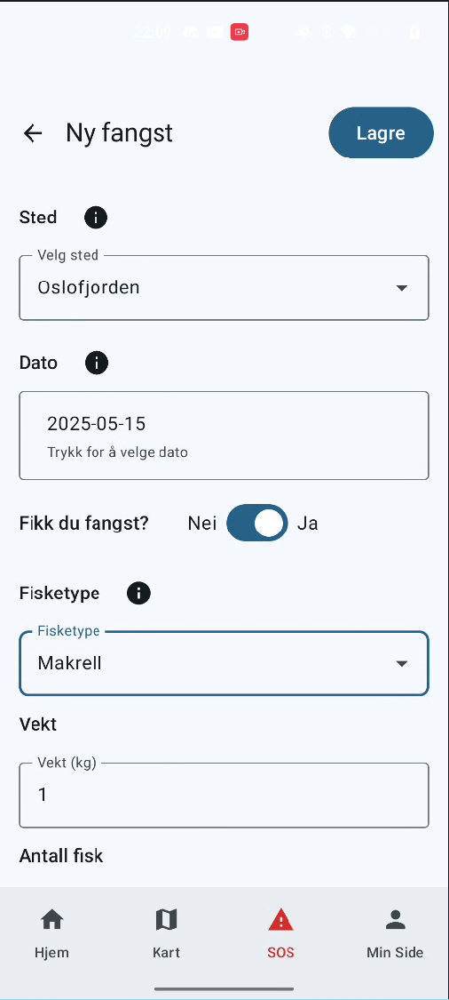
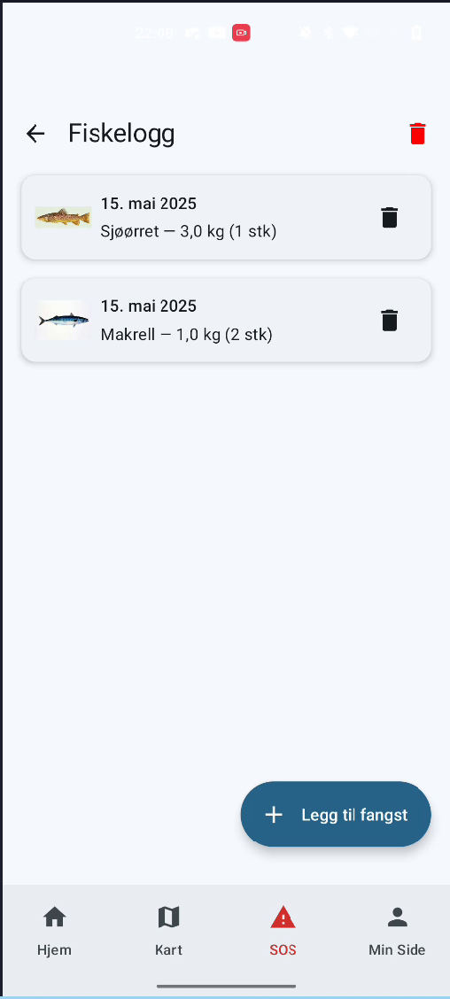
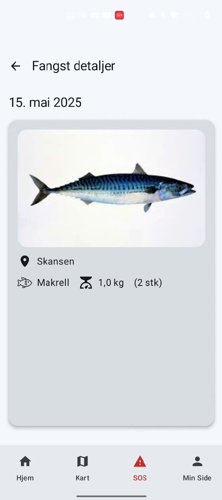
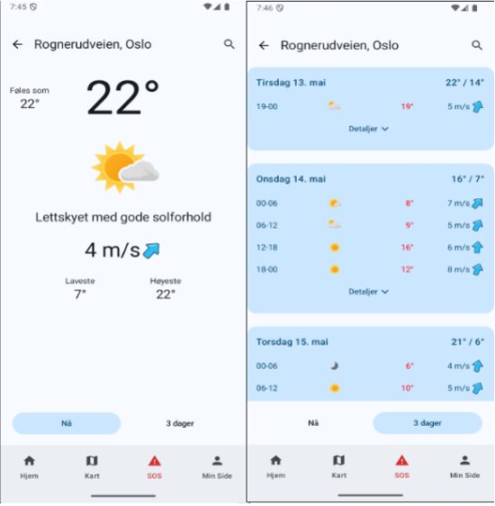
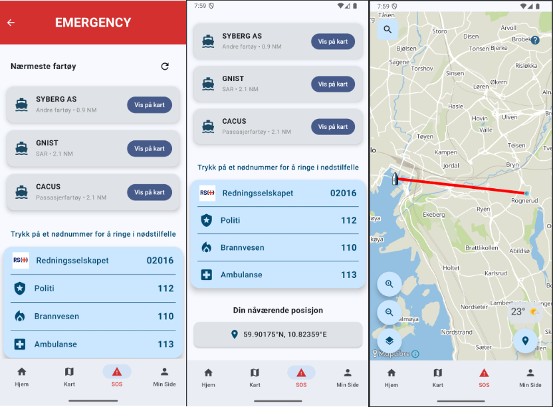

# Welcome to Group 46 in IN2000 – Spring 2025

## Group Members
- **Bendik Mendes Dahl** (bendikmd@uio.no)  
- **Johannes Støen** (johastoe@uio.no)  
- **Mohammad Ali Shakil** (mohas@uio.no)  
- **Kaja Mamelund Bradal** (kajambra@uio.no)  
- **Maria Helena Rogne** (marihrog@uio.no)  
- **Artin Akbari** (artina@uio.no)

## Table of Contents

1. [About the App – VærBitt](#værbitt)  
2. [How to Run the App](#how-to-run-the-app)  
   1. [Requirements](#requirements)  
   2. [Build and Run](#build-and-run)  
   3. [Features](#features)  
3. [Screenshots](#screenshots)  
4. [Dependencies and Libraries](#dependencies-and-libraries)  
5. [Libraries Outside the Curriculum](#libraries-outside-the-curriculum)  
   1. [MapLibre](#maplibre)  
   2. [Coil](#coil)  
   3. [NetCDF-Java / CDM](#netcdf-java--cdm)  
   4. [KSP](#ksp-kotlin-symbol-processing)  
6. [App Permissions](#app-permissions)

---

## VærBitt

<!-- Still deciding on name -->
<p align="center">
  
</p>

**VærBitt** is an Android app developed in Kotlin with Jetpack Compose, designed for hobby fishers and ocean enthusiasts. It displays vessel data, weather alerts, wind and current conditions in real-time on an interactive map, and allows users to log their own catches.

---

## How to Run the App

### Requirements
- Minimum Android version: API 26 (Android 8.0 Oreo)
- Location permission (`ACCESS_FINE_LOCATION`)
- Camera access for profile and catch photos

### Build and Run
1. **Download or clone the repository** from GitHub:
   ```bash
   git clone https://github.uio.no/IN2000-V25/team-46.git

Alternatively, use the "Download ZIP" button on GitHub and extract the project.

2. **Open the project in Android Studio **  
- Choose *"Open an existing project"*
- Navigate to the extracted/cloned folder and open it

3. **Wait for Gradle sync to complete**  
- Android Studio will automatically download dependencies
  
4. **Connect a physical device** or start an **emulator**  
- The device/emulator must run **Android 8.0 (API 26)** or newer  
- Enable **location services** for full functionality  
- Ensure **internet access** is available for full functionality
5. **Build and run the app**  
- Click the run button or use **Shift + F10**  
- On first launch, **grant permissions** when prompted:
  - Location (optional but recommended)
  - Camera (for profile/catch photos)

### Features
- Displays AIS data from BarentsWatch with real-time vessel updates
- Fetches and visualizes wind and current data from GRIB files
- Shows MetAlerts (weather alerts) on the map
- Provides audio and visual alerts when in active alert zones
- Lets users log catches with image and location
- Includes a profile screen with user info and photo

---

## Screenshots

## 📷 Screenshots

###  Catch Log (Fiskelogg)

|                       |                       |                       |
|-----------------------|-----------------------|-----------------------|
|  |  |  |

---

###  Weather Alert Screen



---

###  SOS Screen



### Wheater Screen


---

## Dependencies and Libraries

| Library                        | Purpose                | Description                                                                 |
|-------------------------------|------------------------|-----------------------------------------------------------------------------|
| **Jetpack Compose**           | UI                     | Declarative UI framework for building screens                              |
| **Material 3**                | Design Components      | Modern design elements for Compose                                         |
| **MapLibre GL**               | Map Display            | Open-source map library for showing maps, vessels, and weather data        |
| **Room**                      | Local Database         | Stores catch logs and user data                                            |
| **Kotlinx.coroutines**        | Async Processing       | Fetches data without blocking the UI                                       |
| **Retrofit + Gson**           | API + JSON Parsing     | Communicates with BarentsWatch and MetAlerts APIs *(outside curriculum)*   |
| **OkHttp + Logging Interceptor** | Network Debugging   | Logs HTTP calls for troubleshooting                                        |
| **CDM / GRIB**                | GRIB Parsing           | Reads meteorological GRIB files *(outside curriculum)*                     |
| **AndroidX Location**         | Location Handling      | Tracks user location and handles alerts                                    |
| **Coil**                      | Image Handling         | Loads and displays images for catches and profile                          |
| **KSP**                       | Code Generation        | Used by Room/Hilt to generate boilerplate automatically                    |
| **ViewModel + LiveData**      | State Management       | Reactive UI updates                                                         |

---

## Libraries Outside the Curriculum

### MapLibre
Open-source alternative to Google Maps. Used to display maps, vessels (AIS), wind, currents, and alerts with full control over style and layers.

[MapLibre Docs](https://maplibre.org/maplibre-native/android/api/)

### Coil
Lightweight image loading library for Jetpack Compose, used for catch and profile images.

[Coil Docs](https://coil-kt.github.io/coil/getting_started/)

### NetCDF-Java / CDM
Library by Unidata to read/write scientific datasets (GRIB1/GRIB2). Used to extract wind/current data from GRIB files. Kotlin’s Java interop made integration seamless.

[NetCDF Docs](https://docs.unidata.ucar.edu/netcdf-java/current/userguide/)  
[CDM Docs](https://docs.unidata.ucar.edu/netcdf-java/current/userguide/common_data_model_overview.html)

### KSP (Kotlin Symbol Processing)
Used by Room and Hilt to generate binding and injection code at compile time, reducing boilerplate.

[KSP Docs](https://kotlinlang.org/docs/ksp-overview.html)

---

## App Permissions

| Permission                    | Purpose                                                                 |
|------------------------------|-------------------------------------------------------------------------|
| `ACCESS_FINE_LOCATION`       | To show the user’s location and trigger relevant weather alerts         |
| `CAMERA`                     | To take photos for profile and catch log                                |
| `READ/WRITE_EXTERNAL_STORAGE`| Required if images are saved to the file system                         |

## Further Documentation

For architectural details, file structure, design patterns and modeling diagrams:

- [ARCHITECTURE.md](./ARCHITECTURE.md): Detailed overview of the app's structure, MVVM implementation, and rationale behind chosen patterns and technologies.
- [MODELING.md](./MODELING.md): UML diagrams and system design illustrations supporting key use cases and flows.

