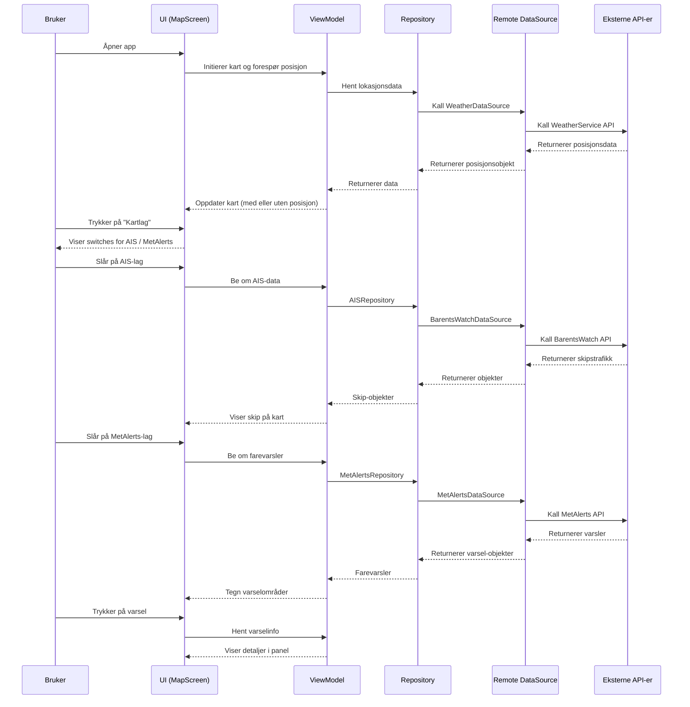

DataFlyt diagram som sekvensdiagram (forenklet)

```mermaid
sequenceDiagram
    participant B as Bruker
    participant UI as UI (MapScreen)
    participant VM as ViewModel
    participant R as Repository
    participant DS as Remote DataSource
    participant API as Eksterne API-er

    B->>UI: Åpner app
    UI->>VM: Initierer kart og forespør posisjon
    VM->>R: Hent lokasjonsdata
    R->>DS: Kall WeatherDataSource
    DS->>API: Kall WeatherService API
    API-->>DS: Returnerer posisjonsdata
    DS-->>R: Returnerer posisjonsobjekt
    R-->>VM: Returnerer data
    VM-->>UI: Oppdater kart (med eller uten posisjon)

    B->>UI: Trykker på "Kartlag"
    UI-->>B: Viser switches for AIS / MetAlerts

    B->>UI: Slår på AIS-lag
    UI->>VM: Be om AIS-data
    VM->>R: AISRepository
    R->>DS: BarentsWatchDataSource
    DS->>API: Kall BarentsWatch API
    API-->>DS: Returnerer skipstrafikk
    DS-->>R: Returnerer objekter
    R-->>VM: Skip-objekter
    VM-->>UI: Viser skip på kart

    B->>UI: Slår på MetAlerts-lag
    UI->>VM: Be om farevarsler
    VM->>R: MetAlertsRepository
    R->>DS: MetAlertsDataSource
    DS->>API: Kall MetAlerts API
    API-->>DS: Returnerer varsler
    DS-->>R: Returnerer varsel-objekter
    R-->>VM: Farevarsler
    VM-->>UI: Tegn varselområder

    B->>UI: Trykker på varsel
    UI->>VM: Hent varselinfo
    VM-->>UI: Viser detaljer i panel


```