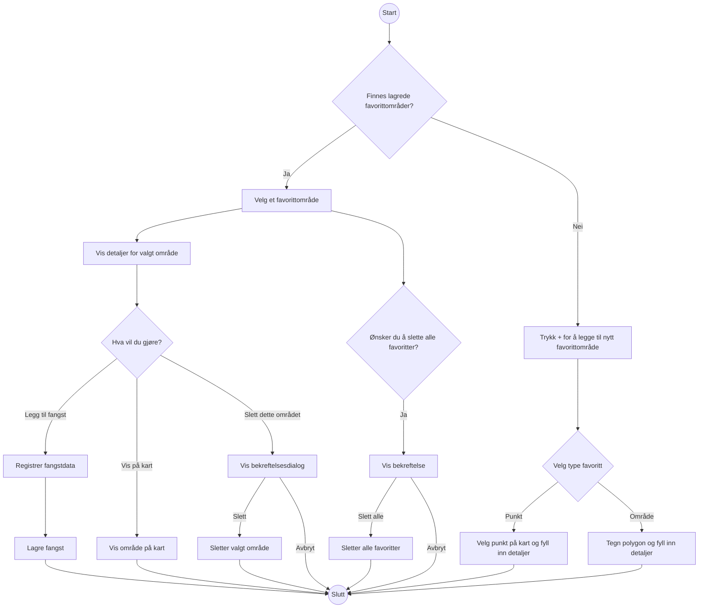

Aktivitetsdiagram for favorittområder

```mermaid
flowchart TD
    Start((Start)) --> FinnFavoritter{Finnes lagrede favorittområder?}

    FinnFavoritter -->|Ja| VelgFavoritt[Velg et favorittområde]
    VelgFavoritt --> VisDetaljer[Vis detaljer for valgt område]

    VisDetaljer --> Valg{Hva vil du gjøre?}
    Valg -->|Legg til fangst| LeggFangst[Registrer fangstdata]
    Valg -->|Vis på kart| VisKart[Vis område på kart]
    Valg -->|Slett dette området| BekreftSlett[Vis bekreftelsesdialog]

    LeggFangst --> LagreFangst[Lagre fangst]
    LagreFangst --> Slutt((Slutt))

    VisKart --> Slutt((Slutt))
    BekreftSlett -->|Slett| SlettOmråde[Sletter valgt område]
    BekreftSlett -->|Avbryt| Slutt((Slutt))
    SlettOmråde --> Slutt((Slutt))

    FinnFavoritter -->|Nei| LeggTilFavoritt[Trykk + for å legge til nytt favorittområde]
    LeggTilFavoritt --> ValgType{Velg type favoritt}
    ValgType -->|Punkt| VelgPunkt[Velg punkt på kart og fyll inn detaljer]
    ValgType -->|Område| TegnOmråde[Tegn polygon og fyll inn detaljer]
    VelgPunkt --> Slutt((Slutt))
    TegnOmråde --> Slutt((Slutt))

    VelgFavoritt --> ValgSlettAlle{Ønsker du å slette alle favoritter?}
    ValgSlettAlle -->|Ja| BekreftSlettAlle[Vis bekreftelse]
    BekreftSlettAlle -->|Slett alle| SlettAlleFavoritter[Sletter alle favoritter]
    BekreftSlettAlle -->|Avbryt| Slutt((Slutt))
    SlettAlleFavoritter --> Slutt((Slutt))
```