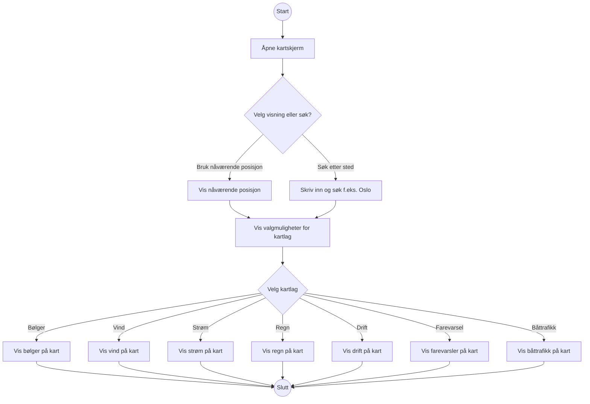

Akitivitetsdiagram for kart-funksjonen

```mermaid
flowchart TD
    Start((Start)) --> ÅpneKart[Åpne kartskjerm]
    ÅpneKart --> VelgSted{Velg visning eller søk?}

    VelgSted -->|Bruk nåværende posisjon| BrukPos[Vis nåværende posisjon]
    VelgSted -->|Søk etter sted| SøkSted[Skriv inn og søk f.eks. Oslo]

    BrukPos --> VisValg
    SøkSted --> VisValg

    VisValg[Vis valgmuligheter for kartlag] --> Valg{Velg kartlag}

    Valg -->|Bølger| VisBølger[Vis bølger på kart]
    Valg -->|Vind| VisVind[Vis vind på kart]
    Valg -->|Strøm| VisStrøm[Vis strøm på kart]
    Valg -->|Regn| VisRegn[Vis regn på kart]
    Valg -->|Drift| VisDrift[Vis drift på kart]
    Valg -->|Farevarsel| VisFare[Vis farevarsler på kart]
    Valg -->|Båttrafikk| VisBåt[Vis båttrafikk på kart]

    VisBølger --> Slutt((Slutt))
    VisVind --> Slutt
    VisStrøm --> Slutt
    VisRegn --> Slutt
    VisDrift --> Slutt
    VisFare --> Slutt
    VisBåt --> Slutt

```