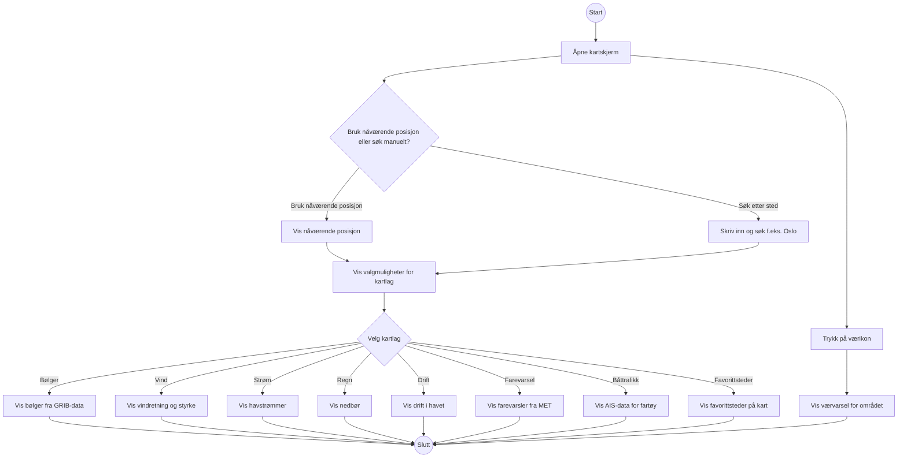

Akitivitetsdiagram for kart-funksjonen

```mermaid
flowchart TD
    Start((Start)) --> ÅpneKart[Åpne kartskjerm]

    ÅpneKart --> VelgSted{Bruk nåværende posisjon eller søk manuelt?}
    VelgSted -->|Bruk nåværende posisjon| BrukPos[Vis nåværende posisjon]
    VelgSted -->|Søk etter sted| SøkSted[Skriv inn og søk f.eks. Oslo]

    BrukPos --> VisValg
    SøkSted --> VisValg

    VisValg[Vis valgmuligheter for kartlag] --> VelgLag{Velg kartlag}

    VelgLag -->|Bølger| VisBølger[Vis bølger fra GRIB-data]
    VelgLag -->|Vind| VisVind[Vis vindretning og styrke]
    VelgLag -->|Strøm| VisStrøm[Vis havstrømmer]
    VelgLag -->|Regn| VisRegn[Vis nedbør]
    VelgLag -->|Drift| VisDrift[Vis drift i havet]
    VelgLag -->|Farevarsel| VisFare[Vis farevarsler fra MET]
    VelgLag -->|Båttrafikk| VisBåt[Vis AIS-data for fartøy]
    VelgLag -->|Favorittsteder| VisFavoritt[Vis favorittsteder på kart]

    ÅpneKart --> VærIkon[Trykk på værikon]
    VærIkon --> VærVisning[Vis værvarsel for området]

    VisBølger --> Slutt((Slutt))
    VisVind --> Slutt
    VisStrøm --> Slutt
    VisRegn --> Slutt
    VisDrift --> Slutt
    VisFare --> Slutt
    VisBåt --> Slutt
    VisFavoritt --> Slutt
    VærVisning --> Slutt

```