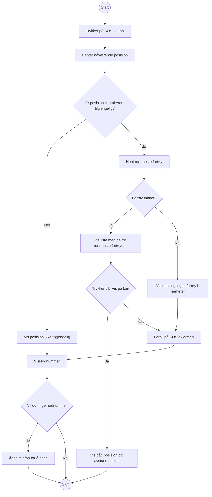

Aktivitetsdiagram for SOS-knapp

```mermaid
flowchart TD
    Start((Start)) --> TrykkSOS[Trykker på SOS-knapp]
    TrykkSOS --> HentPosisjon[Henter nåværende posisjon]
    HentPosisjon --> PosisjonValg{Er posisjon til brukeren tilgjengelig?}
    
    PosisjonValg -->|Nei| Feilmelding[Vis posisjon ikke tilgjengelig]
    PosisjonValg -->|Ja| HentFartøy[Hent nærmeste fartøy]

    HentFartøy --> FartøyValg{Fartøy funnet?}
    FartøyValg -->|Ja| VisFartøy[Vis liste med de tre nærmeste fartøyene]
    FartøyValg -->|Nei| VisIngenFartøy[Vis melding ingen fartøy i nærheten]

    VisFartøy --> KartValg{Trykker på: Vis på kart}
    VisIngenFartøy --> ForbliSOS

    KartValg -->|Ja| ÅpneKart[Vis båt, posisjon og avstand på kart] --> Slutt((Slutt))
    KartValg -->|Nei| ForbliSOS[Forbli på SOS-skjermen] 

    Feilmelding --> VisNødnummer
    ForbliSOS --> VisNødnummer
    VisNødnummer --> NødValg{Vil du ringe nødnummer}

    NødValg -->|Ja| StartAnrop[Åpne telefon for å ringe] --> Slutt
    NødValg -->|Nei| Slutt


```