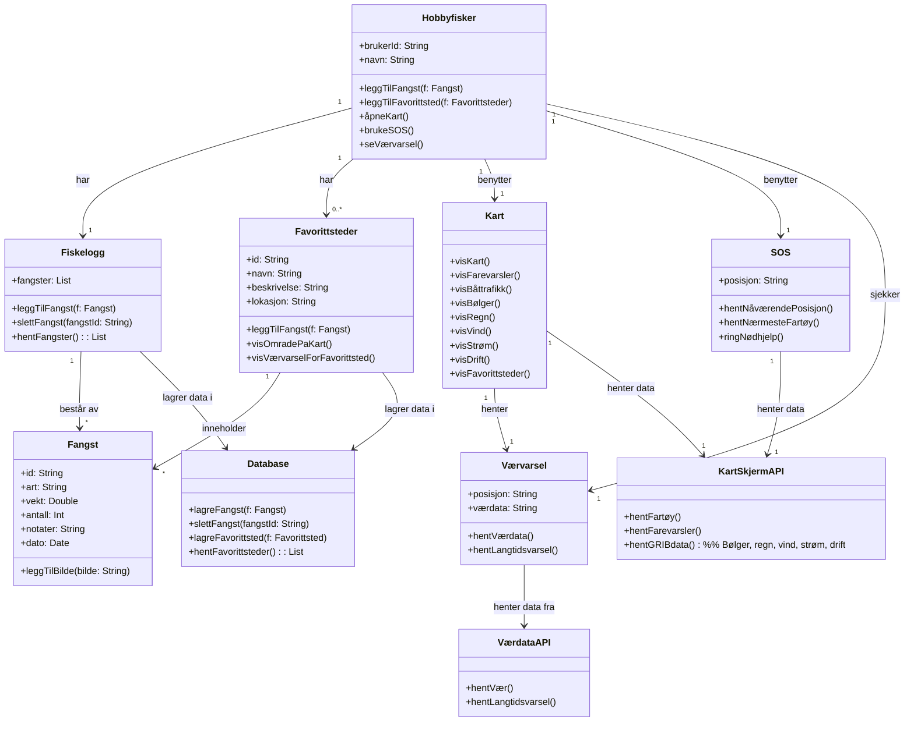

```mermaid
classDiagram
    class Hobbyfisker {
        +brukerId: String
        +navn: String
        +leggTilFangst(f: Fangst)
        +leggTilFavorittsted(f: Favorittsteder)
        +åpneKart()
        +brukeSOS()
        +seVærvarsel()
    }

    class Fiskelogg {
        +fangster: List<Fangst>
        +leggTilFangst(f: Fangst)
        +slettFangst(fangstId: String)
        +hentFangster(): List<Fangst>
    }

    class Fangst {
        +id: String
        +art: String
        +vekt: Double
        +antall: Int
        +notater: String
        +dato: Date
        +leggTilBilde(bilde: String)
    }

    class Favorittsteder {
        +id: String
        +navn: String
        +beskrivelse: String
        +lokasjon: String
        +leggTilFangst(f: Fangst)
        +visOmradePaKart()
        +visVærvarselForFavorittsted()
    }

    class Kart {
        +visKart()
        +visFarevarsler()
        +visBåttrafikk()
        +visBølger()
        +visRegn()
        +visVind()
        +visStrøm()
        +visDrift()
        +visFavorittsteder()
    }

    class Værvarsel {
        +posisjon: String
        +værdata: String
        +hentVærdata()
        +hentLangtidsvarsel()
    }

    class SOS {
        +posisjon: String
        +hentNåværendePosisjon()
        +hentNærmesteFartøy()
        +ringNødhjelp()
    }

    class Database {
        +lagreFangst(f: Fangst)
        +slettFangst(fangstId: String)
        +lagreFavorittsted(f: Favorittsted)
        +hentFavorittsteder(): List<Favorittsteder>
    }

    class VærdataAPI {
        +hentVær()
        +hentLangtidsvarsel()
    }

    class KartSkjermAPI {
        +hentFartøy()
        +hentFarevarsler()
        +hentGRIBdata() %% Bølger, regn, vind, strøm, drift
    }

    Hobbyfisker "1" --> "1" Fiskelogg : har
    Hobbyfisker "1" --> "0..*" Favorittsteder : har
    Hobbyfisker "1" --> "1" Kart : benytter
    Hobbyfisker "1" --> "1" SOS : benytter
    Hobbyfisker "1" --> "1" Værvarsel : sjekker

    Fiskelogg "1" --> "*" Fangst : består av
    Favorittsteder "1" --> "*" Fangst : inneholder

    Kart "1" --> "1" Værvarsel : henter
    Kart "1" --> "1" KartSkjermAPI : henter data
    SOS "1" --> "1" KartSkjermAPI : henter data

    Fiskelogg --> Database : lagrer data i
    Favorittsteder --> Database : lagrer data i
    Værvarsel --> VærdataAPI : henter data fra

```