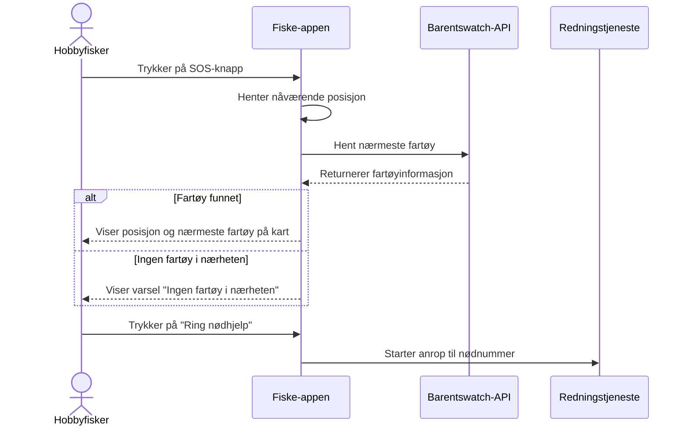

Sekvensdiagram for SOS

```mermaid
sequenceDiagram
    actor Hobbyfisker
    participant App as Fiske-appen
    participant AISAPI as Barentswatch-API
    participant Redning as Redningstjeneste

    Hobbyfisker ->> App: Trykker på SOS-knapp
    App ->> App: Henter nåværende posisjon
    App ->> AISAPI: Hent nærmeste fartøy
    AISAPI -->> App: Returnerer fartøyinformasjon

    alt Fartøy funnet
        App -->> Hobbyfisker: Viser posisjon og nærmeste fartøy på kart
    else Ingen fartøy i nærheten
        App -->> Hobbyfisker: Viser varsel "Ingen fartøy i nærheten"
    end

    Hobbyfisker ->> App: Trykker på "Ring nødhjelp"
    App ->> Redning: Starter anrop til nødnummer


```