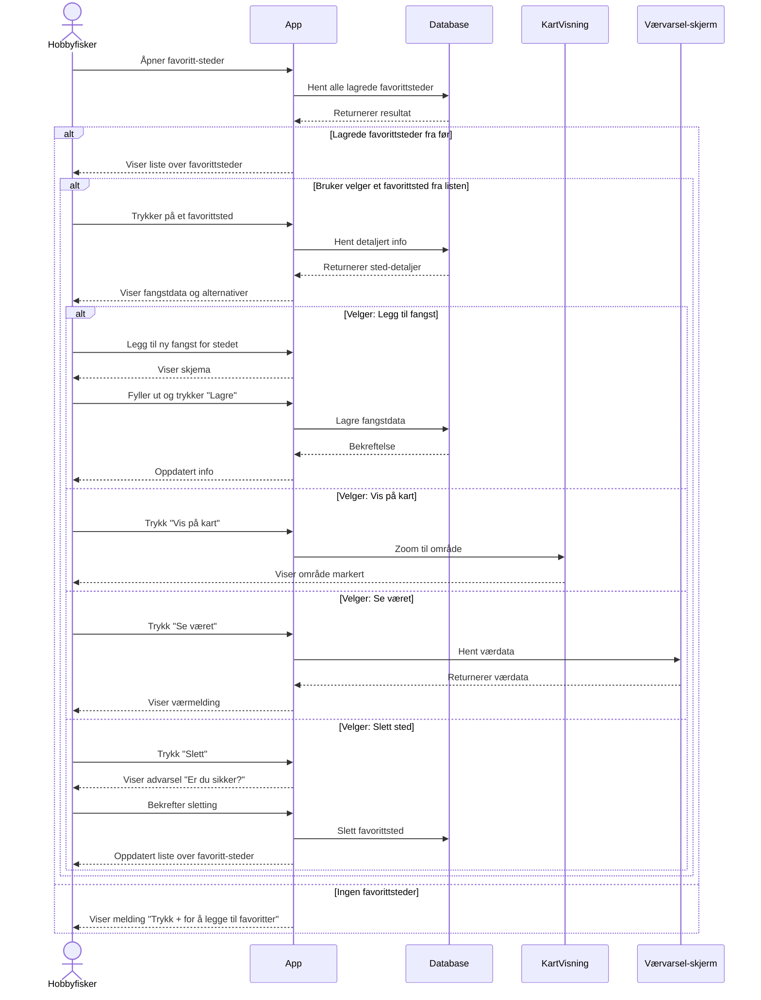

Sekvensdiagram for favoritt-steder

```mermaid
sequenceDiagram
    actor Hobbyfisker
    participant App
    participant Database
    participant KartVisning
    participant Værvarsel-skjerm

    Hobbyfisker ->> App: Åpner favoritt-steder
    App ->> Database: Hent alle lagrede favorittsteder
    Database -->> App: Returnerer resultat

    alt Lagrede favorittsteder fra før
        App -->> Hobbyfisker: Viser liste over favorittsteder

        alt Bruker velger et favorittsted fra listen
            Hobbyfisker ->> App: Trykker på et favorittsted
            App ->> Database: Hent detaljert info
            Database -->> App: Returnerer sted-detaljer
            App -->> Hobbyfisker: Viser fangstdata og alternativer

            alt Velger: Legg til fangst
                Hobbyfisker ->> App: Legg til ny fangst for stedet
                App -->> Hobbyfisker: Viser skjema
                Hobbyfisker ->> App: Fyller ut og trykker "Lagre"
                App ->> Database: Lagre fangstdata
                Database -->> App: Bekreftelse
                App -->> Hobbyfisker: Oppdatert info
            else Velger: Vis på kart
                Hobbyfisker ->> App: Trykk "Vis på kart"
                App ->> KartVisning: Zoom til område
                KartVisning -->> Hobbyfisker: Viser område markert
            else Velger: Se været
                Hobbyfisker ->> App: Trykk "Se været"
                App ->> Værvarsel-skjerm: Hent værdata
                Værvarsel-skjerm -->> App: Returnerer værdata
                App -->> Hobbyfisker: Viser værmelding
            else Velger: Slett sted
                Hobbyfisker ->> App: Trykk "Slett"
                App -->> Hobbyfisker: Viser advarsel "Er du sikker?"
                Hobbyfisker ->> App: Bekrefter sletting
                App ->> Database: Slett favorittsted
                App -->> Hobbyfisker: Oppdatert liste over favoritt-steder
            end
        end

    else Ingen favorittsteder
        App -->> Hobbyfisker: Viser melding "Trykk + for å legge til favoritter"
    end
```
