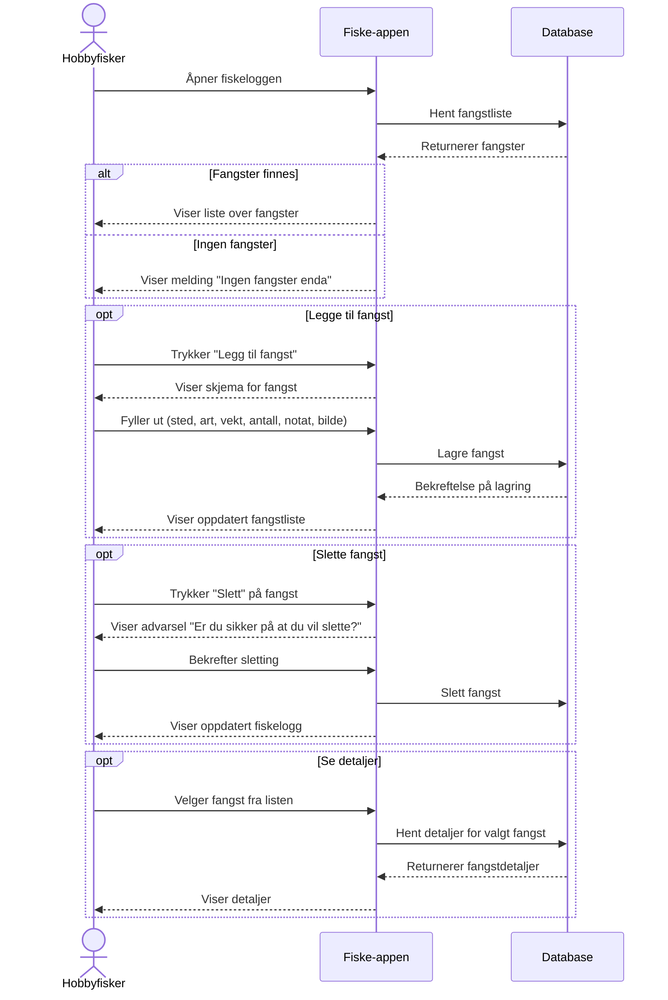

Sekvensdiagram for fiskelogg

```mermaid
sequenceDiagram
    actor Hobbyfisker
    participant App as Fiske-appen
    participant DB as Database

    Hobbyfisker ->> App: Åpner fiskeloggen
    App ->> DB: Hent fangstliste
    DB -->> App: Returnerer fangster

    alt Fangster finnes
        App -->> Hobbyfisker: Viser liste over fangster
    else Ingen fangster
        App -->> Hobbyfisker: Viser melding "Ingen fangster enda"
    end

    opt Legge til fangst
        Hobbyfisker ->> App: Trykker "Legg til fangst"
        App -->> Hobbyfisker: Viser skjema for fangst
        Hobbyfisker ->> App: Fyller ut (sted, art, vekt, antall, notat, bilde)
        App ->> DB: Lagre fangst
        DB -->> App: Bekreftelse på lagring
        App -->> Hobbyfisker: Viser oppdatert fangstliste
    end

    opt Slette fangst
        Hobbyfisker ->> App: Trykker "Slett" på fangst
        App -->> Hobbyfisker: Viser advarsel "Er du sikker på at du vil slette?"
        Hobbyfisker ->> App: Bekrefter sletting
        App ->> DB: Slett fangst
        App -->> Hobbyfisker: Viser oppdatert fiskelogg
    end

    opt Se detaljer
        Hobbyfisker ->> App: Velger fangst fra listen
        App ->> DB: Hent detaljer for valgt fangst
        DB -->> App: Returnerer fangstdetaljer
        App -->> Hobbyfisker: Viser detaljer
    end

```