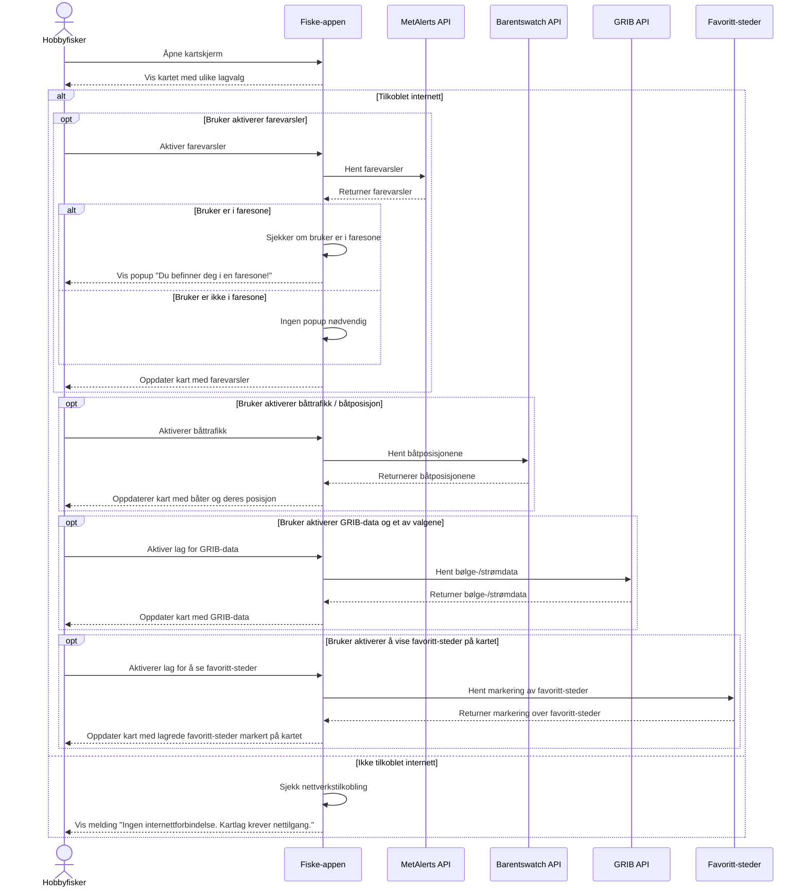

Sekvensdiagram for kartfunksjonalitet

```mermaid
sequenceDiagram
    actor H as Hobbyfisker
    participant A as Fiske-appen
    participant M as MetAlerts API
    participant B as Barentswatch API
    participant G as GRIB API
    participant F as Favoritt-steder

    H ->> A: Åpne kartskjerm
    A -->> H: Vis kartet med ulike lagvalg

    alt Tilkoblet internett
        opt Bruker aktiverer farevarsler
            H ->> A: Aktiver farevarsler
            A ->> M: Hent farevarsler
            M -->> A: Returner farevarsler
            
            alt Bruker er i faresone
                A ->> A: Sjekker om bruker er i faresone
                A -->> H: Vis popup "Du befinner deg i en faresone!"
            else Bruker er ikke i faresone
                A ->> A: Ingen popup nødvendig
            end

            A -->> H: Oppdater kart med farevarsler
        end
        
        opt Bruker aktiverer båttrafikk / båtposisjon
            H ->> A: Aktiverer båttrafikk
            A ->> B: Hent båtposisjonene
            B -->> A: Returnerer båtposisjonene
            A -->> H: Oppdaterer kart med båter og deres posisjon
        end

        opt Bruker aktiverer GRIB-data og et av valgene
            H ->> A: Aktiver lag for GRIB-data
            A ->> G: Hent bølge-/strømdata
            G -->> A: Returner bølge-/strømdata
            A -->> H: Oppdater kart med GRIB-data
        end

        opt Bruker aktiverer å vise favoritt-steder på kartet
            H ->> A: Aktiverer lag for å se favoritt-steder
            A ->> F: Hent markering av favoritt-steder
            F -->> A: Returner markering over favoritt-steder
            A -->> H: Oppdater kart med lagrede favoritt-steder markert på kartet
        end

    else Ikke tilkoblet internett
        A ->> A: Sjekk nettverkstilkobling
        A -->> H: Vis melding "Ingen internettforbindelse. Kartlag krever nettilgang."
    end
```