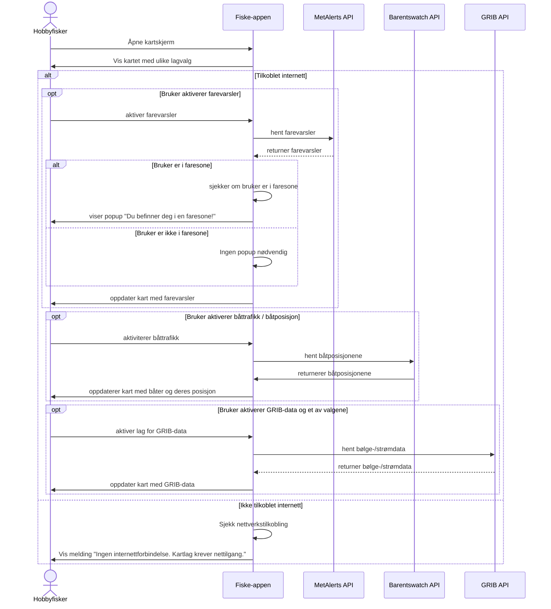

Sekvensdiagram for kartfunksjonalitet

```mermaid
sequenceDiagram
    actor H as Hobbyfisker
    participant A as Fiske-appen
    participant M as MetAlerts API
    participant B as Barentswatch API
    participant G as GRIB API

    H ->> A: Åpne kartskjerm
    A ->> H: Vis kartet med ulike lagvalg

    alt Tilkoblet internett
   opt Bruker aktiverer farevarsler
        H->>A: aktiver farevarsler
        A->>M: hent farevarsler
        M-->>A: returner farevarsler
        
        alt Bruker er i faresone
            A->>A: sjekker om bruker er i faresone
            A->>H: viser popup "Du befinner deg i en faresone!"

        else Bruker er ikke i faresone
            A->>A: Ingen popup nødvendig
        end

        A->>H: oppdater kart med farevarsler
    end
    
    opt Bruker aktiverer båttrafikk / båtposisjon
        H->> A: aktiviterer båttrafikk
        A ->> B: hent båtposisjonene
        B ->> A: returnerer båtposisjonene
        A ->> H: oppdaterer kart med båter og deres posisjon
    end

    opt Bruker aktiverer GRIB-data og et av valgene
        H->>A: aktiver lag for GRIB-data
        A->>G: hent bølge-/strømdata
        G-->>A: returner bølge-/strømdata
        A->>H: oppdater kart med GRIB-data
    end

    else Ikke tilkoblet internett
        A->>A: Sjekk nettverkstilkobling
        A->>H: Vis melding "Ingen internettforbindelse. Kartlag krever nettilgang."
    end

```