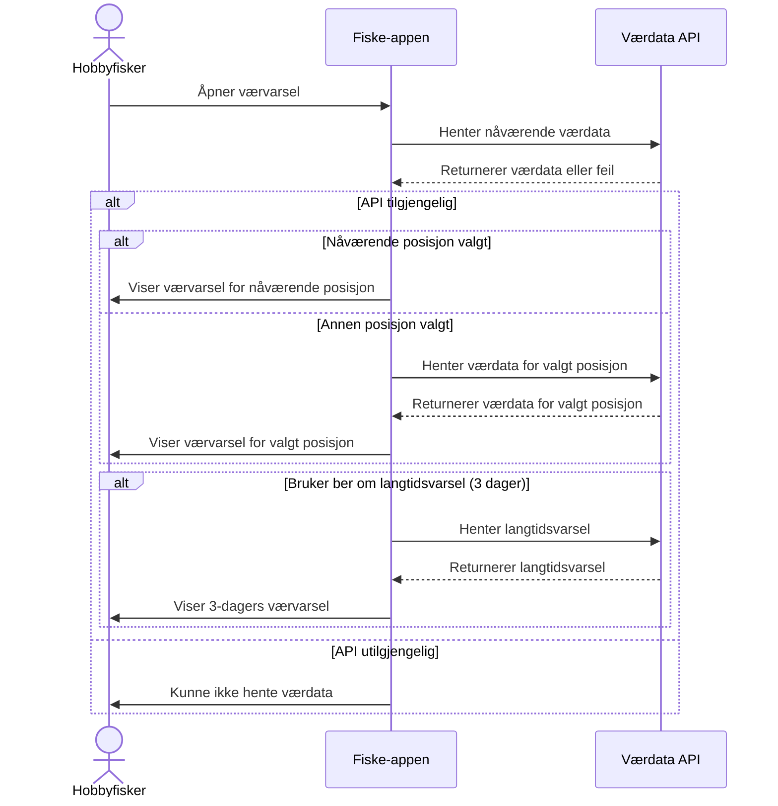

Sekvensdiagram for værvarsel

```mermaid
sequenceDiagram
    actor Hobbyfisker
    participant App as Fiske-appen
    participant VærAPI as Værdata API

    Hobbyfisker ->> App: Åpner værvarsel
    App ->> VærAPI: Henter nåværende værdata
    VærAPI -->> App: Returnerer værdata eller feil

    alt API tilgjengelig
        alt Nåværende posisjon valgt
            App ->> Hobbyfisker: Viser værvarsel for nåværende posisjon
        else Annen posisjon valgt
            App ->> VærAPI: Henter værdata for valgt posisjon
            VærAPI -->> App: Returnerer værdata for valgt posisjon
            App ->> Hobbyfisker: Viser værvarsel for valgt posisjon
        end

        alt Bruker ber om langtidsvarsel (3 dager)
            App ->> VærAPI: Henter langtidsvarsel
            VærAPI -->> App: Returnerer langtidsvarsel
            App ->> Hobbyfisker: Viser 3-dagers værvarsel
        end
    else API utilgjengelig
        App ->> Hobbyfisker: Kunne ikke hente værdata
    end

```